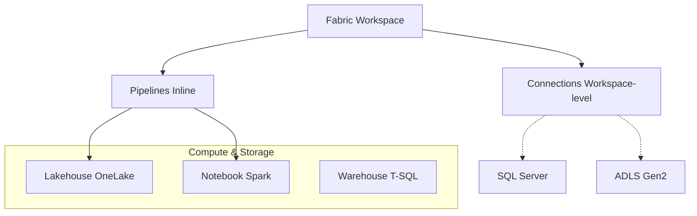

<ArchitectureDiagramMetadataFabric />

# Complete Guide: Migrating Azure Data Factory Pipelines to Microsoft Fabric

*A comprehensive technical deep-dive into migrating ETL pipelines from ADF to Fabric Data Factory with real-world examples*

---

## Table of Contents

1. [Introduction](#introduction)
2. [Prerequisites](#prerequisites)
3. [Architecture Comparison](#architecture-comparison)
4. [Key Structural Differences](#key-structural-differences)
5. [Step 1: Setting Up Connections](#step-1-setting-up-connections)
6. [Step 2: Migrating Bronze Layer Pipeline](#step-2-migrating-bronze-layer-pipeline)
7. [Step 3: Migrating Silver Layer with Notebooks](#step-3-migrating-silver-layer-with-notebooks)
8. [Step 4: Creating Lakehouse Shortcuts](#step-4-creating-lakehouse-shortcuts)
9. [Step 5: Implementing Email Notifications](#step-5-implementing-email-notifications)
10. [Step 6: Deploying via Fabric REST API](#step-6-deploying-via-fabric-rest-api)
11. [Handling Schema Evolution](#handling-schema-evolution)
12. [Common Pitfalls and Solutions](#common-pitfalls-and-solutions)
13. [Performance Considerations](#performance-considerations)
14. [Conclusion](#conclusion)

---

## Introduction

Microsoft Fabric represents a unified analytics platform that brings together data engineering, data science, real-time analytics, and business intelligence. For organizations with existing Azure Data Factory (ADF) investments, migrating pipelines to Fabric Data Factory is a strategic move toward platform consolidation.

This guide documents a real-world migration project implementing a **medallion architecture** (Bronze → Silver → Gold) ETL pipeline. We'll cover every technical detail, from JSON structure changes to notebook parameterization quirks that took hours to debug.

**Project Scope:**
- **Source:** On-premises SQL Server (AdventureWorks)
- **Target:** Azure Data Lake Storage Gen2 + Fabric Lakehouse
- **Layers:** Bronze (Parquet), Silver (Delta), Gold (Star Schema)
- **Orchestration:** Fabric Data Factory Pipelines
- **Compute:** Fabric Notebooks (PySpark)

---

## Prerequisites

Before starting the migration, ensure you have:

1. **Fabric Workspace** with capacity assigned
2. **Fabric Lakehouse** created for shortcuts
3. **On-premises Data Gateway** configured (for SQL Server connectivity)
4. **Azure Data Lake Storage Gen2** account
5. **Connections created in Fabric:**
   - On-premises SQL Server connection
   - Azure SQL Database connection (for metadata)
   - ADLS Gen2 connection
   - Office 365 Outlook connection (for notifications)

---

## Architecture Comparison

### ADF Architecture

```mermaid
graph TD
    LS[Linked Services JSON] --> DS[Datasets JSON]
    DS --> PL[Pipelines JSON]
    PL --> ACT[Activities]
    
    subgraph Data Stores
        SQL[SQL Server]
        Blob[Blob Storage]
        DBX[Databricks]
    end
    
    LS -.-> Data Stores
    
    subgraph Integration Runtime
        IR[Self-hosted / Azure IR]
    end
```

### Fabric Architecture



### Key Architectural Differences

<div className="my-12 overflow-hidden rounded-xl border border-white/10 bg-white/5 shadow-2xl backdrop-blur-sm">
  <table className="w-full text-left text-sm text-neutral-400">
    <thead className="bg-white/5 text-xs uppercase tracking-wider text-white">
      <tr>
        <th className="px-6 py-4 font-semibold">Aspect</th>
        <th className="px-6 py-4 font-semibold">Azure Data Factory</th>
        <th className="px-6 py-4 font-semibold">Fabric Data Factory</th>
      </tr>
    </thead>
    <tbody className="divide-y divide-white/5">
      <tr className="hover:bg-white/5 transition-colors">
        <td className="px-6 py-4 font-medium text-white">Linked Services</td>
        <td className="px-6 py-4">Separate JSON definitions</td>
        <td className="px-6 py-4">Workspace-level connections <span className="text-xs font-mono text-cyan-400">(GUID)</span></td>
      </tr>
      <tr className="hover:bg-white/5 transition-colors">
        <td className="px-6 py-4 font-medium text-white">Datasets</td>
        <td className="px-6 py-4">Separate JSON definitions</td>
        <td className="px-6 py-4">Inline <code className="bg-white/10 px-1 py-0.5 rounded text-white">datasetSettings</code></td>
      </tr>
      <tr className="hover:bg-white/5 transition-colors">
        <td className="px-6 py-4 font-medium text-white">Integration Runtime</td>
        <td className="px-6 py-4">Self-hosted IR / Azure IR</td>
        <td className="px-6 py-4">On-premises Data Gateway</td>
      </tr>
      <tr className="hover:bg-white/5 transition-colors">
        <td className="px-6 py-4 font-medium text-white">Compute</td>
        <td className="px-6 py-4">Databricks / Synapse</td>
        <td className="px-6 py-4">Fabric Spark <span className="text-xs font-mono text-cyan-400">(Trident)</span></td>
      </tr>
      <tr className="hover:bg-white/5 transition-colors">
        <td className="px-6 py-4 font-medium text-white">Storage</td>
        <td className="px-6 py-4">Blob / Gen2 / SQL</td>
        <td className="px-6 py-4">OneLake <span className="text-xs font-mono text-cyan-400">(Unified)</span></td>
      </tr>
      <tr className="hover:bg-white/5 transition-colors">
        <td className="px-6 py-4 font-medium text-white">Metadata</td>
        <td className="px-6 py-4">ARM Templates</td>
        <td className="px-6 py-4">Fabric REST API</td>
      </tr>
    </tbody>
  </table>
</div>

---

## Key Structural Differences

### Pipeline JSON Root Structure

**ADF Pipeline:**
```json
{
  "$schema": "https://schema.management.azure.com/schemas/...",
  "name": "PL_Bronze_Ingestion",
  "properties": {
    "activities": [],
    "parameters": {},
    "variables": {},
    "annotations": []
  },
  "type": "Microsoft.DataFactory/factories/pipelines"
}
```

**Fabric Pipeline:**
```json
{
  "name": "PL_Bronze_Ingestion",
  "properties": {
    "description": "Pipeline description",
    "activities": [],
    "parameters": {},
    "variables": {},
    "annotations": []
  }
}
```

**Key differences:**
- No `$schema` property in Fabric
- No `type` property at root level
- Folder structure defined inside `properties`

### Expression Syntax

**ADF Expression:**
```json
{
  "sqlReaderQuery": "@concat('SELECT * FROM ', pipeline().parameters.TableName)"
}
```

**Fabric Expression:**
```json
{
  "sqlReaderQuery": {
    "value": "@concat('SELECT * FROM ', pipeline().parameters.TableName)",
    "type": "Expression"
  }
}
```

**Critical:** In Fabric, dynamic values require explicit `value` and `type` properties.

### Connection References

**ADF (Linked Service Reference):**
```json
{
  "linkedServiceName": {
    "referenceName": "LS_SqlServer_OnPrem",
    "type": "LinkedServiceReference"
  }
}
```

**Fabric (External Reference):**
```json
{
  "externalReferences": {
    "connection": "<sql_server_connection_id>"
  }
}
```

---

## Step 1: Setting Up Connections

### Create Connections in Fabric Workspace

Navigate to **Workspace Settings → Connections** and create:

| Connection Name | Type | Purpose |
|----------------|------|---------|
| SQL_Server_OnPrem | SQL Server | Source data (on-premises) |
| Azure_SQL_Config | Azure SQL Database | Metadata/config database |
| ADLS_DataLake | Azure Data Lake Storage Gen2 | Bronze/Silver/Gold storage |
| Outlook_Notifications | Office 365 Outlook | Email alerts |

### Document Connection IDs

After creating connections, note their GUIDs. You'll find them in the connection URL or via API:

```bash
# List all connections in workspace
curl -X GET "https://api.fabric.microsoft.com/v1/workspaces/<workspace_id>/connections" \
  -H "Authorization: Bearer $TOKEN"
```

Create a mapping file for reference:
```json
{
  "connections": {
    "sql_server_onprem_connection_id": "<your-sql-connection-guid>",
    "azure_sql_config_connection_id": "<your-azure-sql-guid>",
    "adls_datalake_connection_id": "<your-adls-guid>",
    "outlook_connection_id": "<your-outlook-guid>"
  },
  "workspace_id": "<your-workspace-guid>",
  "lakehouse_id": "<your-lakehouse-guid>",
  "notebook_id": "<your-notebook-guid>"
}
```

---

## Step 2: Migrating Bronze Layer Pipeline

The Bronze layer extracts data from SQL Server and lands it as Parquet files in ADLS.

### Handling Unsupported SQL Server Data Types

SQL Server has data types that Parquet doesn't natively support:
- `geography` / `geometry` (spatial types)
- `text` / `ntext` (legacy LOB types)
- `image` (legacy binary)
- `xml`
- `hierarchyid`

**Solution:** Dynamic column query that converts problematic types:

```json
{
  "name": "Check_Column_Types",
  "type": "Lookup",
  "dependsOn": [],
  "policy": {
    "timeout": "0.00:05:00",
    "retry": 2,
    "retryIntervalInSeconds": 30
  },
  "typeProperties": {
    "source": {
      "type": "SqlServerSource",
      "sqlReaderQuery": {
        "value": "@concat('SELECT STRING_AGG(CASE WHEN t.name IN (''geography'', ''geometry'') THEN ''CASE WHEN '' + QUOTENAME(c.name) + '' IS NULL THEN NULL ELSE '' + QUOTENAME(c.name) + ''.STAsText() END AS '' + QUOTENAME(c.name) WHEN t.name IN (''text'', ''ntext'') THEN ''CAST('' + QUOTENAME(c.name) + '' AS NVARCHAR(MAX)) AS '' + QUOTENAME(c.name) WHEN t.name = ''image'' THEN ''CONVERT(NVARCHAR(MAX), CONVERT(VARBINARY(MAX), '' + QUOTENAME(c.name) + ''), 1) AS '' + QUOTENAME(c.name) WHEN t.name = ''xml'' THEN ''CAST('' + QUOTENAME(c.name) + '' AS NVARCHAR(MAX)) AS '' + QUOTENAME(c.name) ELSE QUOTENAME(c.name) END, '', '') WITHIN GROUP (ORDER BY c.column_id) AS ColumnList FROM sys.columns c INNER JOIN sys.types t ON c.user_type_id = t.user_type_id WHERE c.object_id = OBJECT_ID(''', pipeline().parameters.SchemaName, '.', pipeline().parameters.TableName, ''')')",
        "type": "Expression"
      },
      "queryTimeout": "00:05:00"
    },
    "datasetSettings": {
      "type": "SqlServerTable",
      "schema": {
        "value": "@pipeline().parameters.SchemaName",
        "type": "Expression"
      },
      "table": {
        "value": "@pipeline().parameters.TableName",
        "type": "Expression"
      },
      "externalReferences": {
        "connection": "<sql_server_onprem_connection_id>"
      }
    },
    "firstRowOnly": true
  },
  "externalReferences": {
    "connection": "<sql_server_onprem_connection_id>"
  }
}
```

### Building Dynamic Source Query

Use SetVariable to construct the SELECT statement:

```json
{
  "name": "Build_Source_Query",
  "type": "SetVariable",
  "dependsOn": [
    {
      "activity": "Check_Column_Types",
      "dependencyConditions": ["Succeeded"]
    }
  ],
  "policy": {
    "secureOutput": false,
    "secureInput": false
  },
  "typeProperties": {
    "variableName": "SourceQuery",
    "value": {
      "value": "@concat('SELECT ', activity('Check_Column_Types').output.firstRow.ColumnList, ' FROM [', pipeline().parameters.SchemaName, '].[', pipeline().parameters.TableName, ']')",
      "type": "Expression"
    }
  }
}
```

### Copy Activity Configuration

**Critical:** Note the `fileSystem` property - this specifies the ADLS container name:

```json
{
  "name": "Copy_to_Bronze",
  "type": "Copy",
  "dependsOn": [
    {
      "activity": "Build_Source_Query",
      "dependencyConditions": ["Succeeded"]
    }
  ],
  "policy": {
    "timeout": "0.02:00:00",
    "retry": 2,
    "retryIntervalInSeconds": 60
  },
  "typeProperties": {
    "source": {
      "type": "SqlServerSource",
      "sqlReaderQuery": {
        "value": "@variables('SourceQuery')",
        "type": "Expression"
      },
      "queryTimeout": "02:00:00",
      "partitionOption": "None",
      "datasetSettings": {
        "type": "SqlServerTable",
        "schema": {
          "value": "@pipeline().parameters.SchemaName",
          "type": "Expression"
        },
        "table": {
          "value": "@pipeline().parameters.TableName",
          "type": "Expression"
        },
        "externalReferences": {
          "connection": "<sql_server_onprem_connection_id>"
        }
      }
    },
    "sink": {
      "type": "ParquetSink",
      "storeSettings": {
        "type": "AzureBlobFSWriteSettings"
      },
      "formatSettings": {
        "type": "ParquetWriteSettings"
      },
      "datasetSettings": {
        "type": "Parquet",
        "typeProperties": {
          "location": {
            "type": "AzureBlobFSLocation",
            "fileSystem": "datalake",
            "folderPath": {
              "value": "@concat('bronze/', toLower(pipeline().parameters.SourceSystemName), '/', toLower(pipeline().parameters.SchemaName), '/', pipeline().parameters.TableName, '/', pipeline().parameters.ProcessingDate)",
              "type": "Expression"
            },
            "fileName": {
              "value": "@concat(pipeline().parameters.TableName, '_', pipeline().parameters.ProcessingDate, '.parquet')",
              "type": "Expression"
            }
          },
          "compressionCodec": "snappy"
        },
        "externalReferences": {
          "connection": "<adls_datalake_connection_id>"
        }
      }
    },
    "enableStaging": false
  },
  "externalReferences": {
    "connection": "<sql_server_onprem_connection_id>"
  }
}
```

### Pipeline Parameters

```json
{
  "parameters": {
    "TableId": {
      "type": "Int",
      "defaultValue": 0
    },
    "SourceSystemName": {
      "type": "String"
    },
    "SchemaName": {
      "type": "String"
    },
    "TableName": {
      "type": "String"
    },
    "ProcessingDate": {
      "type": "String"
    },
    "LoadType": {
      "type": "String",
      "defaultValue": "Full"
    },
    "IncrementalColumn": {
      "type": "String",
      "defaultValue": ""
    },
    "WatermarkValue": {
      "type": "String",
      "defaultValue": ""
    }
  },
  "variables": {
    "SourceQuery": {
      "type": "String"
    }
  }
}
```

---

## Step 3: Migrating Silver Layer with Notebooks

### The Notebook Parameterization Challenge

This was the most challenging part of the migration. Fabric notebooks handle parameters differently than Databricks.

**Key Discovery:** The parameters cell toggle in Fabric notebooks **cannot be reliably set via API**. When you upload a notebook definition via API, the toggle resets!

### Solution: Manual Parameter Cell Configuration

**Step 1:** Create your notebook with a parameters cell as the first code cell:

```python
# PARAMETERS
# Parameters - These will be overridden by pipeline
bronze_path = "abfss://datalake@<storage_account>.dfs.core.windows.net/bronze/source/schema/Table"
silver_path = "abfss://datalake@<storage_account>.dfs.core.windows.net/silver/source/schema/Table"
schema_name = "schema"
table_name = "Table"
primary_keys = "Id"
load_type = "Full"
processing_date = "2024-01-01"
table_id = "1"
```

**Step 2:** In Fabric UI, manually toggle the parameters cell:
1. Open the notebook in Fabric workspace
2. Click on the first code cell
3. Click the `...` (more options) menu
4. Select **"Toggle parameter cell"**
5. You should see a "Parameters" tag appear on the cell
6. **Save the notebook**

**Step 3:** Never re-upload the notebook via API after this - only update through UI or use the update API carefully.

### TridentNotebook Activity Configuration

```json
{
  "name": "Process_Bronze_to_Silver",
  "type": "TridentNotebook",
  "dependsOn": [
    {
      "activity": "Log_Silver_Start",
      "dependencyConditions": ["Succeeded"]
    }
  ],
  "policy": {
    "timeout": "0.02:00:00",
    "retry": 2,
    "retryIntervalInSeconds": 60
  },
  "typeProperties": {
    "notebookId": "<notebook_id>",
    "workspaceId": "<workspace_id>",
    "parameters": {
      "bronze_path": {
        "value": "@item().BronzePath",
        "type": "string"
      },
      "silver_path": {
        "value": "@item().SilverPath",
        "type": "string"
      },
      "schema_name": {
        "value": "@item().SchemaName",
        "type": "string"
      },
      "table_name": {
        "value": "@item().TableName",
        "type": "string"
      },
      "primary_keys": {
        "value": "@coalesce(item().PrimaryKeyColumns, '')",
        "type": "string"
      },
      "load_type": {
        "value": "@item().LoadType",
        "type": "string"
      },
      "processing_date": {
        "value": "@pipeline().parameters.ProcessingDate",
        "type": "string"
      },
      "table_id": {
        "value": "@string(item().TableId)",
        "type": "string"
      }
    }
  }
}
```

**Important Notes:**
- Parameter names are **case-sensitive**
- All parameter types should be `"string"` (Fabric converts internally)
- Use `@coalesce()` for nullable parameters
- Use `@string()` to convert integers to strings

### Complete Silver Transformation Notebook

```python
# Cell 1: PARAMETERS (Toggle as parameter cell!)
# Parameters - Overridden by pipeline
bronze_path = "abfss://datalake@<storage_account>.dfs.core.windows.net/bronze/source/schema/Table"
silver_path = "abfss://datalake@<storage_account>.dfs.core.windows.net/silver/source/schema/Table"
schema_name = "schema"
table_name = "Table"
primary_keys = "Id"
load_type = "Full"
processing_date = "2024-01-01"
table_id = "1"
```

```python
# Cell 2: Imports and Setup
from pyspark.sql.functions import *
from pyspark.sql.types import *
from pyspark.sql.window import Window
from delta.tables import DeltaTable
import json

print(f"=== Bronze to Silver Transformation ===")
print(f"Schema: {schema_name}")
print(f"Table: {table_name}")
print(f"Load Type: {load_type}")
print(f"Processing Date: {processing_date}")
print(f"Bronze Path: {bronze_path}")
print(f"Silver Path: {silver_path}")
```

```python
# Cell 3: Read Bronze Data
bronze_full_path = f"{bronze_path}/{processing_date}"
print(f"Reading from: {bronze_full_path}")

bronze_df = spark.read.parquet(bronze_full_path)
bronze_count = bronze_df.count()
print(f"Bronze records: {bronze_count}")
```

```python
# Cell 4: Data Cleansing & Add Metadata
silver_df = bronze_df \
    .withColumn("_bronze_load_date", lit(processing_date).cast("date")) \
    .withColumn("_silver_load_timestamp", current_timestamp()) \
    .withColumn("_source_file", input_file_name())

# Trim strings and replace empty with null
string_cols = [f.name for f in silver_df.schema.fields if isinstance(f.dataType, StringType)]
for c in string_cols:
    silver_df = silver_df.withColumn(c, when(trim(col(c)) == "", None).otherwise(trim(col(c))))

print(f"After cleansing: {silver_df.count()} records")
```

```python
# Cell 5: Deduplication
pk_cols = [pk.strip() for pk in primary_keys.split(",") if pk.strip()]

if pk_cols:
    print(f"Deduplicating on: {pk_cols}")
    w = Window.partitionBy(pk_cols).orderBy(desc("_silver_load_timestamp"))
    silver_df = silver_df.withColumn("_rn", row_number().over(w)) \
                         .filter(col("_rn") == 1) \
                         .drop("_rn")
    print(f"After dedupe: {silver_df.count()} records")
else:
    print("No primary keys defined, skipping deduplication")
```

```python
# Cell 6: Write to Silver (Delta) with Schema Evolution
print(f"Writing Delta to: {silver_path}")

# Enable schema evolution
spark.conf.set("spark.databricks.delta.schema.autoMerge.enabled", "true")

if load_type.upper() == "FULL":
    print("Mode: FULL (overwrite)")
    silver_df.write \
        .format("delta") \
        .mode("overwrite") \
        .option("overwriteSchema", "true") \
        .save(silver_path)

elif load_type.upper() == "INCREMENTAL" and pk_cols:
    print("Mode: INCREMENTAL (merge)")
    try:
        is_delta = DeltaTable.isDeltaTable(spark, silver_path)
    except Exception as e:
        print(f"Delta check failed: {str(e)[:100]}")
        is_delta = False

    if is_delta:
        try:
            dt = DeltaTable.forPath(spark, silver_path)
            merge_cond = " AND ".join([f"t.{pk} = s.{pk}" for pk in pk_cols])
            dt.alias("t").merge(silver_df.alias("s"), merge_cond) \
                .whenMatchedUpdateAll() \
                .whenNotMatchedInsertAll() \
                .execute()
            print("Merge completed")
        except Exception as merge_error:
            print(f"Merge failed (schema mismatch?): {str(merge_error)[:150]}")
            print("Falling back to overwrite with schema evolution...")
            silver_df.write \
                .format("delta") \
                .mode("overwrite") \
                .option("overwriteSchema", "true") \
                .save(silver_path)
            print("Overwrite completed with new schema")
    else:
        print("Delta table not exists, creating new...")
        silver_df.write.format("delta").mode("overwrite") \
            .option("overwriteSchema", "true").save(silver_path)
else:
    print("Mode: APPEND")
    silver_df.write.format("delta").mode("append") \
        .option("mergeSchema", "true").save(silver_path)

print("Delta write completed!")
```

```python
# Cell 7: Return Results to Pipeline
from notebookutils import mssparkutils

# Get record count
final_count = spark.read.format("delta").load(silver_path).count()

# Get Delta version
try:
    history_df = spark.sql(f"DESCRIBE HISTORY delta.`{silver_path}` LIMIT 1")
    latest_version = history_df.select("version").collect()[0][0]
except:
    latest_version = 0

result = {
    "status": "Success",
    "schema": schema_name.lower(),
    "table": table_name.lower(),
    "records_processed": final_count,
    "delta_version": latest_version,
    "silver_path": silver_path
}

print(f"\n=== Processing Complete ===")
print(json.dumps(result, indent=2))

# Return result to pipeline
mssparkutils.notebook.exit(json.dumps(result))
```

---

## Step 4: Creating Lakehouse Shortcuts

Lakehouse shortcuts allow you to query ADLS Delta tables directly from Fabric SQL endpoint without data movement.

### Shortcut Naming Convention

We use a layer-prefixed schema naming:
- Silver tables: `silver_{schema}.{table}`
- Gold tables: `gold_{schema}.{table}`

This prevents all tables from landing in the default `dbo` schema.

### Creating Shortcuts via Fabric API

Add this to your Silver notebook:

```python
# Cell 8: Create Lakehouse Shortcut
import re
import time
import requests
from notebookutils import mssparkutils

print(f"\n=== Creating Lakehouse Shortcut ===")

# Configuration
workspace_id = '<workspace_id>'
lakehouse_id = '<lakehouse_id>'
connection_id = '<adls_datalake_connection_id>'

# Get Fabric API token
fabric_url = 'https://api.fabric.microsoft.com/'
access_token = mssparkutils.credentials.getToken(fabric_url)

headers = {
    "Authorization": f"Bearer {access_token}",
    "Content-Type": "application/json"
}

# Parse ADLS path: abfss://container@account.dfs.core.windows.net/path
match = re.match(r'abfss://([^@]+)@([^.]+)\.dfs\.core\.windows\.net/(.+)', silver_path)

if match:
    container = match.group(1)
    storage_account = match.group(2)
    subpath = match.group(3)

    # Create schema with layer prefix
    lakehouse_schema = f"silver_{schema_name.lower()}"
    table_name_lower = table_name.lower()

    print(f"Storage Account: {storage_account}")
    print(f"Container: {container}")
    print(f"Subpath: {subpath}")
    print(f"Target: {lakehouse_schema}.{table_name_lower}")

    # Create schema first
    try:
        spark.sql(f"CREATE SCHEMA IF NOT EXISTS {lakehouse_schema}")
        print(f"Schema '{lakehouse_schema}' created/verified")
    except Exception as e:
        print(f"Schema note: {str(e)[:100]}")

    # Shortcut API endpoint
    api_url = f"https://api.fabric.microsoft.com/v1/workspaces/{workspace_id}/items/{lakehouse_id}/shortcuts"

    # Check if shortcut exists
    shortcut_path = f"Tables/{lakehouse_schema}/{table_name_lower}"
    check_url = f"{api_url}/{shortcut_path}"

    check_response = requests.get(check_url, headers=headers)

    # Delete existing shortcut if exists
    if check_response.status_code == 200:
        print("Shortcut exists, deleting...")
        requests.delete(check_url, headers=headers)
        time.sleep(2)

    # Create shortcut payload
    payload = {
        "path": f"Tables/{lakehouse_schema}",
        "name": table_name_lower,
        "target": {
            "AdlsGen2": {
                "location": f"https://{storage_account}.dfs.core.windows.net",
                "subpath": f"{container}/{subpath}",
                "connectionId": connection_id
            }
        }
    }

    # Create shortcut
    response = requests.post(api_url, headers=headers, json=payload)

    if response.status_code == 201:
        print(f"SUCCESS: Shortcut '{lakehouse_schema}.{table_name_lower}' created!")
    elif response.status_code == 409:
        print("Shortcut already exists")
    else:
        print(f"Error creating shortcut: {response.text}")
```
